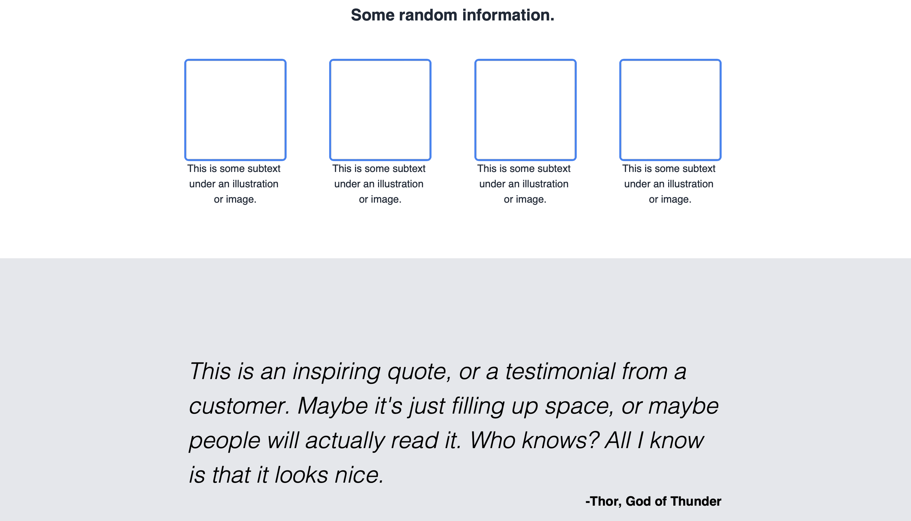
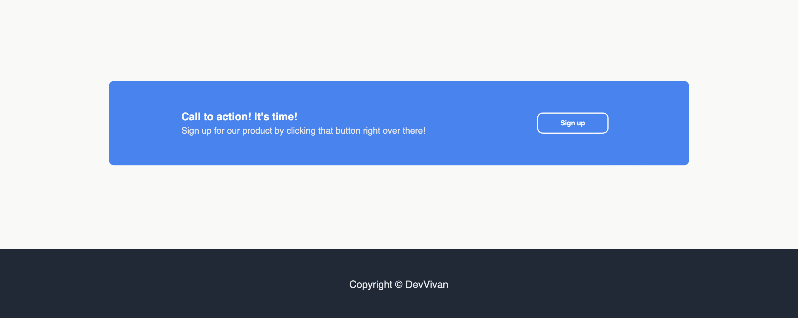

# Landing Page

This was landing page, the [*2nd project*](https://www.theodinproject.com/lessons/foundations-landing-page) within the Odin Project curriculum. This was an assignment designed to make students create an entire web page from a design provided.

In this recipes project, I revised my CSS knowledge, applying the basics of flexbox to align and alter the layout of my landing page. Following the design image and the fonts & colors image, I gave my attempt in re-creating a page to to the best of my abilities

## Links

- [*Live Preview*](https://devvivan.github.io/odin-landing-page/)
- [*My Progress*](https://github.com/DevVivan/odin-project)

## What did this project teach me?

### CSS

- Using a CSS Reset
- Flexbox: `flex-direction`, `justify-content`, `align-items`
- The Box Model
- Using `border-radius`

### Other

- Breaking down projects into sections, and sections into sub-sections
- Consolidation of the [*Git Workflow*](https://www.theodinproject.com/lessons/foundations-git-basics)

## Images

